# DXL-Coverage

## 需求描述

1. 撰写一个DOORS脚本或程序，编程语言不限，自动化统计覆盖率，至少涵盖：

    1）系统需求覆盖干系人需求的覆盖率

    2）系统架构覆盖系统需求的覆盖率

    3）软件需求覆盖系统需求的覆盖率

    4）软件需求覆盖系统架构的覆盖率

    5）软件架构覆盖软件需求的覆盖率

    6）软件详细设计覆盖软件架构的覆盖率

    7）软件单元测试用例覆盖软件详细设计的覆盖率

    8）软件集成测试用例覆盖软件架构的覆盖率

    9）软件合格性测试覆盖软件需求的覆盖率

    10）系统集成测试用例覆盖系统架构的覆盖率

    11）系统合格性测试用例覆盖系统需求的覆盖率

2. 一键计算当前项目中所有的覆盖率，并输出结果至EXCEL文档

3. 输出的每一份结果涵盖：需求或测试用例的数目，以及根据DOORS link关系统计出来的覆盖率百分比

4. 可用来统计不同项目的覆盖率

5. VW Matrix里要求的一些具体数字，比如客户需求数量，具体需要统计的列表和算法我们都会提供给到你们

6. 注意事项：

    1）项目中每层级的文档数量可能涵盖多个（例如：Stakeholder Requirements）

    2）每层级文档中属性的属性值可能不一样（客户提供统计规则）

    3）各层级文档链接关系单独存放在各自对应的Link模块中

    4）可以自行设置以统计不同发布阶段统计的覆盖率，也可统计全部的覆盖率

## 业务用例分析

### 创建目录文件夹

- 00 Admin
- 01 干系人需求
- 02 系统需求
- 03 系统架构
- 04 软件需求
- 05 软件架构
- 06 软件详细设计*
- 07 软件单元测试用例*
- 08 软件集成测试用例
- 09 软件合格性测试用例
- 10 系统集成测试用例
- 11 系统合格性测试用例

### 创建Admin文件夹模板结构

- A 需求覆盖率统计模块
- 11个正式模块模板
  - 文档目录
  - 默认链接模块
  - 属性
    - 对象属性
    - 模块属性
  - 公共视图
- 链接模块
  - 满足
  - 验证

## 需求覆盖率统计模块概念设计

